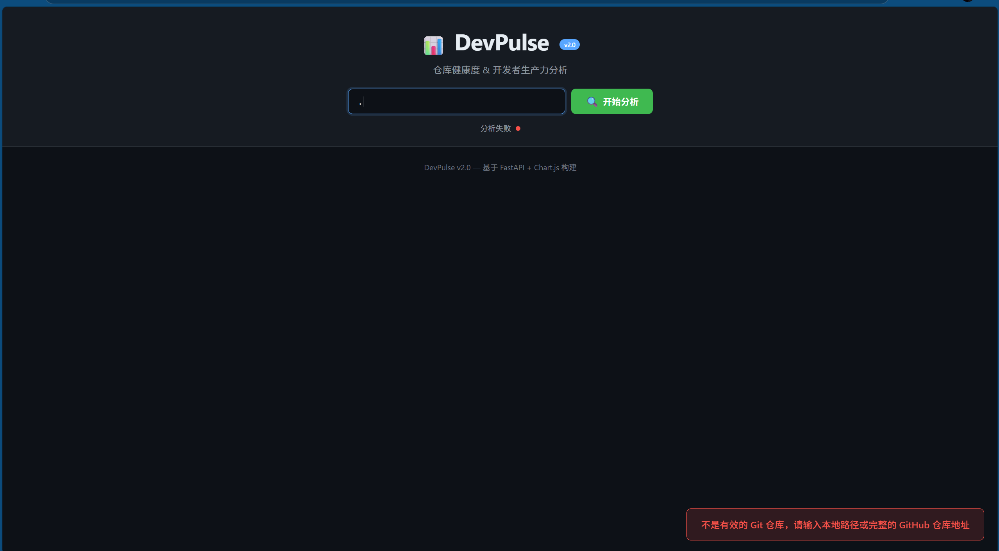

# 🚀 DevPulse

> **你的代码仓库到底健不健康？让数据说话！**
>
> 别他妈再靠直觉管理项目了。把 Git 仓库丢进来，秒出仪表盘——谁在摸鱼、哪个文件天天改出 Bug、代码量是不是已经烂成屎山，一目了然。

<div align="center">


</div>

---

## 🤔 这玩意儿干嘛的？

简单说：**把 `git log` 那些枯燥的日志变成老板看得懂的酷炫图表**。

你是不是经常遇到这种灵魂拷问：

- "这周代码写得怎么样？" —— 你支支吾吾 "还行吧"
- "谁改的 Bug 最多？" —— 内心 OS：肯定不是我（心虚）
- "这个项目到底有多少行代码？" —— 你打开 VS Code 文件统计……发现 node_modules 也算进去了，tmd

**DevPulse 就是来终结这种尴尬的。** 一个命令启动 → 浏览器打开 → 所有数据可视化甩老板脸上。

---

## ✨ 能干嘛

| 功能 | 翻译成人话 |
|---------|-------------|
| 📊 **提交活跃度** | 最近 90 天谁在 996、谁在摸鱼，柱状图不会骗人 |
| 👥 **贡献者排行** | 按 commit 数排名，卷王自动登顶，适合截图发工作群 |
| 🗂️ **代码语言构成** | 环形图告诉你这项目到底是 Python 屎山还是 Java 屎山 |
| 📝 **代码变更追踪** | 哪些文件天天改？新增 vs 删除行数，重构了还是单纯在加屎 |
| 🌿 **分支概览** | 当前在哪条 branch 上、一共有多少条死分支没删 |
| 📁 **文件类型分布** | .js 比 .ts 多就别吹自己用 TypeScript 了好吧 |
| 🐳 **Docker 一键部署** | 别再说 "在我机器上能跑" 了，Docker 懂？ |
| ⚡ **CI/CD 就绪** | GitHub Actions 自动跑测试和 lint，Push 即用 |

---

## 📸 有图有真相



> 就问你这暗色主题帅不帅？GitHub 同款配色，半夜写代码眼睛不瞎。

---

## 🏗️ 代码怎么组织的

```
DevPulse/
├── src/
│   ├── main.py                 # FastAPI 入口，API 全在这儿
│   ├── analyzer/
│   │   ├── git_analyzer.py     # 核心：把 git 命令行输出变成结构化数据
│   │   └── code_stats.py       # 数代码行数的，支持 30+ 语言识别
│   ├── models/
│   │   └── schemas.py          # Pydantic 模型，类型安全不写 TS 也行
│   └── utils/
│       └── helpers.py          # 就几个工具函数，没啥好看的
├── static/
│   ├── index.html              # 仪表盘 UI，单文件搞定
│   ├── css/style.css           # GitHub 暗色主题，骚得一批
│   ├── js/app.js               # Chart.js 画图，前端仔看了都说好
│   └── img/8.png               # 截图，快看上面的图！
├── tests/
│   └── test_analyzer.py        # 13 个测试，覆盖率不低（真的）
├── .github/workflows/ci.yml    # Push 自动跑测试，不怕改崩
├── Dockerfile                  # 生产级 Docker，不是玩具
├── docker-compose.yml          # 一键启动，不折腾
├── requirements.txt            # 就三个依赖，轻得要命
├── LICENSE                     # MIT，随便用，Star 就行
└── README.md                   # 你他妈正在读的这个
```

---

## 🚀 五分钟跑起来

### 你需要有

- **Python 3.10+**（都 2026 年了不会还用 Python 2 吧）
- **Git**（没有 Git 你分析个毛线）

### 开搞

```bash
# 先克隆下来
git clone https://github.com/gongjiantao/DevPulse.git
cd DevPulse

# 创建虚拟环境（别直接在系统 Python 上装，算我求你）
python -m venv venv

# 激活（Windows 用户看这条）
venv\Scripts\activate

# 激活（Mac/Linux 用户看这条，不用 sudo 谢谢）
source venv/bin/activate

# 装依赖（就三个包，秒装完）
pip install -r requirements.txt

# 跑起来！
uvicorn src.main:app --host 0.0.0.0 --port 8000 --reload
```

打开浏览器，输入 **http://localhost:8000**，默认分析当前目录。

你也可以输入一个 GitHub 仓库地址，比如 `https://github.com/tiangolo/fastapi`，它会自动 clone 下来分析——**科技，tmd 就是科技**。

### 懒人 Docker 版

```bash
# 一行启动
docker compose up -d

# 或者自己 build
docker build -t devpulse .
docker run -p 8000:8000 -v /path/to/你的烂项目:/repo devpulse
```

---

## 🔌 API 文档（给想集成的人看）

所有接口都是 `GET`，参数直接拼 URL 上，简单粗暴。

| 接口 | 干嘛的 |
|----------|--------|
| `GET /api/health` | "还活着吗？" —— "活着" |
| `GET /api/stats?repo_path=.` | 返回所有统计数据，一次性全给你 |
| `GET /api/code?repo_path=.` | 只看代码行数和语言分布 |
| `GET /api/contributors?repo_path=.` | 只看谁写了多少 commit |
| `GET /api/activity?repo_path=.&days=90` | 只看提交热力图 |
| `GET /api/churn?repo_path=.` | 只看文件改动统计 |
| `GET /api/branches?repo_path=.` | 只看分支信息 |

### 返回数据长这样

```json
{
  "is_git_repo": true,
  "repo_path": "/Users/alice/my-project",
  "commit_count": 245,
  "contributors": [
    { "name": "Alice", "email": "alice@example.com", "commits": 120 },
    { "name": "Bob", "email": "bob@example.com", "commits": 85 }
  ],
  "commit_activity": [
    { "date": "2025-02-15", "commits": 5 }
  ],
  "code_churn": {
    "total_added": 15234,
    "total_deleted": 8721,
    "net_change": 6513
  },
  "branch_info": {
    "current_branch": "main",
    "branch_count": 5
  }
}
```

> Bob 只写了 85 个 commit？这就叫 **"数据驱动的人才盘点"**，建议直接把 JSON 贴群里 @Bob。

---

## 🧪 跑测试

```bash
# 跑一遍，全绿就是心安
pytest tests/ -v

# 看看覆盖率，别自欺欺人
pytest tests/ --cov=src --cov-report=term-missing
```

目前 13 个测试全过，覆盖了核心分析逻辑。没测前端——前端点击按钮还能点出 Bug？交互就那几个，真要测我选择手动点。

---

## 🤖 CI/CD —— Push 即正义

Push 到 `main` 自动触发 GitHub Actions：

1. 🐍 Python 3.10 / 3.11 / 3.12 三个版本全跑一遍测试
2. 🧹 Ruff 检查代码风格（别写屎代码）
3. 📊 生成覆盖率报告
4. 🐳 构建 Docker 镜像验证能 build 出来

一整套流水线，比某些公司的发布流程还完整（不是针对谁）。

---

## 🛠️ 技术栈

| 技术 | 为什么选它 |
|-----------|---------|
| [**FastAPI**](https://fastapi.tiangolo.com/) | 快。自动生成 Swagger 文档，写 API 跟呼吸一样简单 |
| [**Chart.js**](https://www.chartjs.org/) | 免费、好看、不折腾。比 D3.js 友好一万倍 |
| [**Pydantic**](https://docs.pydantic.dev/) | Python 的类型安全最后一道防线 |
| [**Uvicorn**](https://www.uvicorn.org/) | ASGI 服务器，快就一个字 |
| [**Docker**](https://www.docker.com/) | 不解释，2026 年还不用 Docker 的程序员建议转行 |
| [**GitHub Actions**](https://github.com/features/actions) | 白嫖的 CI，不用白不用 |
| [**Pytest**](https://docs.pytest.org/) | Python 测试的事实标准 |

---

## 📄 开源协议

MIT License —— 随便 Fork、随便改、随便商用。**唯一的要求：Star 一个不过分吧？**

---

## 🙌 想贡献？来

1. Fork 这个仓库
2. `git checkout -b feature/你觉得牛逼的功能`
3. 写代码、写测试（别光写不测）
4. `git commit -m '加了个牛逼功能' ; git push origin feature/你觉得牛逼的功能`
5. 开 Pull Request，我们一起看你的代码

---

<div align="center">

### "Talk is cheap. Show me the dashboard."

基于 **FastAPI + Chart.js** 糊出来的 ❤️

⭐ **Star 了再用，不 Star 也能用，但你忍心吗？**

</div>
